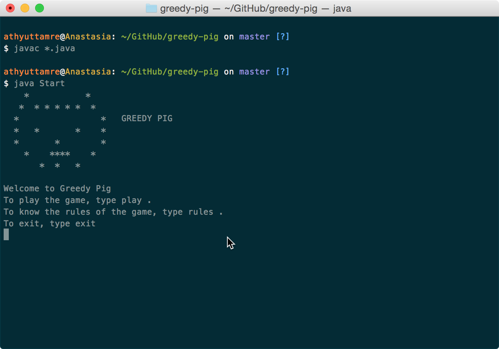

# Greedy Pig



Greedy Pig is a simple single-player dice game built for the terminal. It was the final project for my first computer science class in high-school, circa 2010.

## Rules

The rules are simple.

Two players play the game. In each turn, a player rolls the dice and adds the number rolled to her turn score. If she rolls a 1, her turn ends, and the turn score resets to zero. If she chooses to hold, her turn score is added to her total score. After this, the other player rolls. The first player to reach 100 wins.

In this version of Greedy Pig, the second player is the computer, with varying levels of artificial intelligence.

## How to Play

To play the game, first clone the repository or download it as a ZIP file. Navigate into the directory, and run the following in your terminal:

```
javac *.java
java Start
```

To exit the game, type <kbd>Ctrl</kbd> + <kbd>c</kbd>.

## Notes

This version of the code is only slightly updated from my original submission on 16 October 2010. At the time, I was taking the Computer Applications class in grade 10 at the Rishi Valley School in India. I'm forever grateful to my teacher, Rishi Jayaram, for introducing me to computer science. 

README.txt is the original readme file included with the code.  